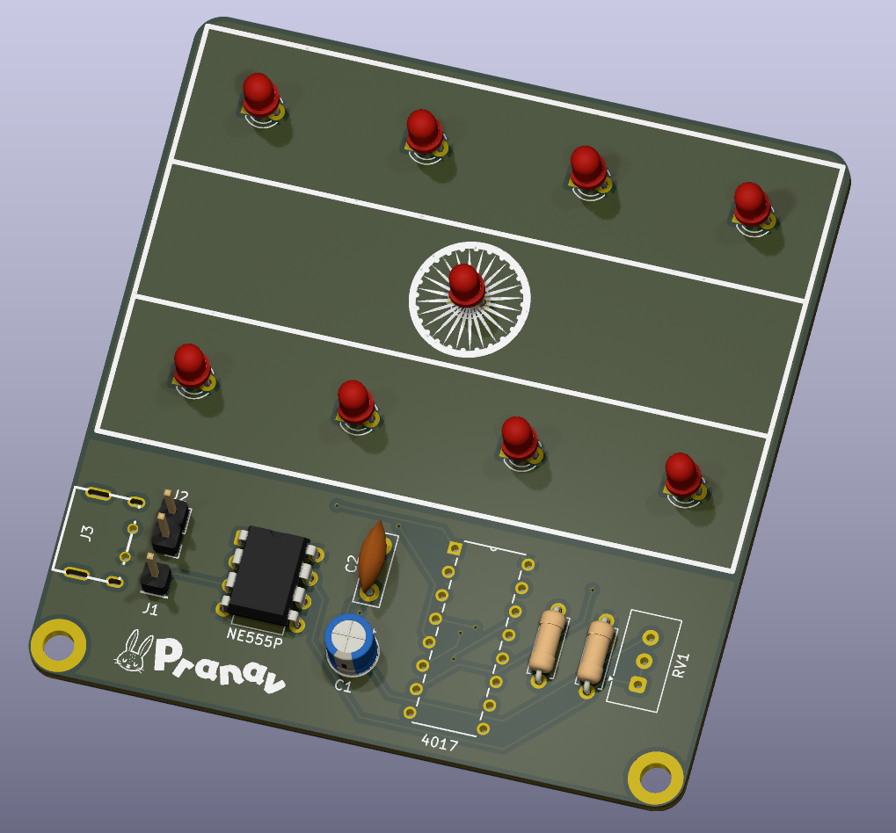
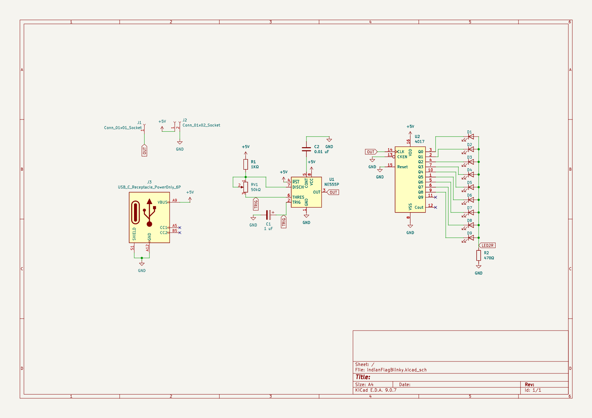
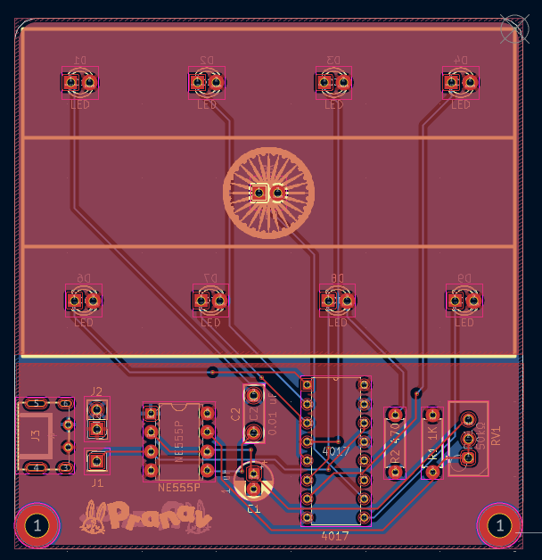
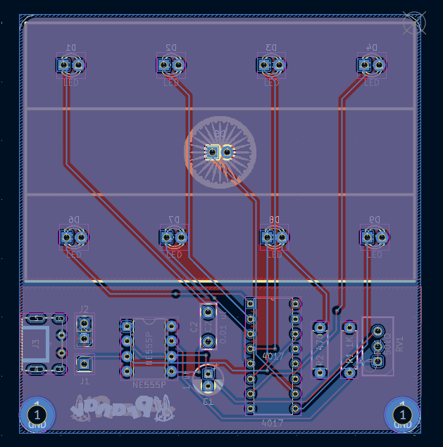

# Indian flag Blinky

This is my version of the Blueprint "Blinky Board", but redesigned around the Indian flag. It uses 9 LEDs, 4 in the top row, 4 in the bottom, and 1 in the middle to represent the "Ashoka Chakra", or the blue coloured wheel in the center of the flag. The blinking of the LEDs also creates a wave effect that mimics the movement of the flag in the wind. All the other circuitry is below the 2:3 rectangle of the flag, the same as described in the Flag Code of India. I have also added a small logo with my name and my characteristic "Bunny". The inspiration for this project came from the maple leaf board in the guide, and I wanted to create something similar for my home country of India.

The circuit is based on a 555 timer in astable mode driving a CD4017 decade counter, which sequentially lights up 10 LEDs.

# PCB
*Made in KiCad*

# BOM:
* PCB (with Shipping) - USD 10.5
* LED IC 4017
* 1 uF Capacitor
* 0.01 uF Capacitor
* LEDs,9,Kit
* PinHeader 1x01
* PinHeader 1x02
* Timer IC NE555P
* 1KΩ Re
* 470Ω Re
* Potentiometer 50K
* USB-C-TH_TYPE-C-31-M-33 header (self sourced)
